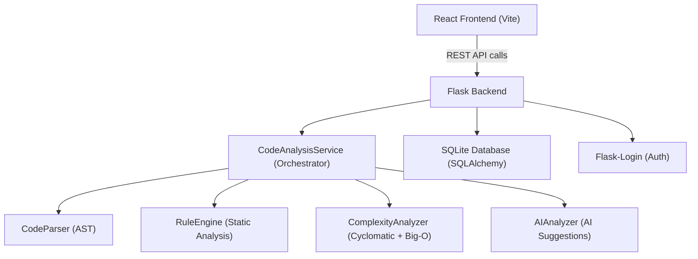

# 🧠 AI Code Review Assistant — Complete Technical Reference

A full breakdown of every technique, algorithm, design pattern, and technology used in this project.

---

## 📐 System Architecture



The project follows a **clean layered architecture**:

| Layer | Role |
|---|---|
| **Frontend** | React SPA — sends code, displays results |
| **API Routes** | Flask REST endpoints — receives requests, returns JSON |
| **Service Layer** | Orchestrates analysis pipeline |
| **Analysis Engine** | 4 dedicated modules (Parser, Rules, Complexity, AI) |
| **Data Layer** | SQLAlchemy ORM over SQLite |
| **Auth Layer** | Flask-Login with Werkzeug password hashing |

---

## ⚙️ Analysis Pipeline — Step by Step

When a user submits code to `/api/analyze`, this exact 4-step pipeline runs:

```
Input Code
   │
   ▼
[Step 1] CodeParser      → AST parse → extract functions, classes, imports, variables
   │
   ▼
[Step 2] RuleEngine      → run 13 static analysis rules → list of Issues
   │
   ▼
[Step 3] ComplexityAnalyzer → Cyclomatic + Big-O complexity per function
   │
   ▼
[Step 4] AIAnalyzer      → Generate improvement suggestions (rule-based or Anthropic API)
   │
   ▼
Result compiled → saved to DB → returned as JSON
```

---

## 🔬 Algorithm 1 — AST-Based Code Parsing (`parser.py`)

**Technique**: Abstract Syntax Tree (AST) Traversal

Python's built-in `ast` module is used to parse the source code into a syntax tree. The parser then **walks the tree** to extract:

| Extracted Data | How |
|---|---|
| Functions | `ast.FunctionDef` nodes → name, line, args, return type, decorators |
| Classes | `ast.ClassDef` nodes → name, methods, base classes |
| Imports | `ast.Import` / `ast.ImportFrom` nodes |
| Variables | `ast.Assign` nodes at global scope |

**Key technique: `ast.walk(tree)`** — recursively visits every node in the tree regardless of nesting depth.

---

## 🔬 Algorithm 2 — Static Analysis Rules (`rules.py`)

**Technique**: Pattern-based rule checking on the AST

The `RuleEngine` runs **13 independent rule checkers**, each flagging specific code quality problems. Issues are classified by severity: `critical > warning > info`.

### Existing Rules

| Rule | Algorithm | Severity |
|---|---|---|
| **Long Functions** | Count `num_statements > 50` per function | warning |
| **Too Many Arguments** | Count `len(args) > 5` | warning |
| **Deep Nesting** | Recursive DFS on AST: count `If/For/While/With/Try` depth > 4 | warning |
| **Unused Imports** | String search: check if import name appears elsewhere in source | info |
| **Naming Conventions** | Regex: `^[a-z_][a-z0-9_]*$` for functions (snake_case), `^[A-Z][a-zA-Z0-9]*$` for classes (PascalCase) | info |
| **Missing Docstrings** | AST check: first node in `body` must be `ast.Expr` with `ast.Constant` | info |
| **Magic Numbers** | Walk tree for `ast.Constant` of type int/float, exclude common values {0,1,-1,2,10,100} | info |
| **Duplicate Code** | Sliding window of 3-line tuples; check for repeating sequences | warning |
| **Global Variables** | Check variable scope == 'global' from parsed data | info |
| **Bare Except Clauses** | `ast.ExceptHandler` nodes where `node.type is None` | warning |

### New Rules (Recently Added)

| Rule | Algorithm | Severity |
|---|---|---|
| **Unused Variables** | Two-pass AST walk: collect all `ast.Assign` targets, then all `ast.Name(Load)` usages → diff = unused | warning |
| **Dead Code** | Walk function bodies; if `Return/Break/Continue` appears at index `i`, check if `i < len(body)-1` | warning |
| **Infinite Loops** | Find `ast.While` nodes where `test == ast.Constant(True)` and no `ast.Break` child found | warning |

> **Sorting**: All issues are sorted by severity before returning, so critical issues appear first.

---

## 🔬 Algorithm 3 — Cyclomatic Complexity (`complexity.py`)

**Technique**: McCabe Cyclomatic Complexity

Cyclomatic complexity = number of **independent paths** through a function.

**Formula**: Start at 1, add +1 for each:
- `if` statement
- `for` loop
- `while` loop
- `except` handler
- `with` statement
- `assert` statement
- `and`/`or` boolean operators (each extra operand = +1)
- Comprehensions (`list`, `dict`, `set`, `generator`) + their `if` filters

**Risk Thresholds**:

| Score | Risk Level |
|---|---|
| ≤ 10 | 🟢 Low |
| 11–20 | 🟡 Medium |
| 21–50 | 🔴 High |
| > 50 | 🚨 Very High |

---

## 🔬 Algorithm 4 — Big-O Complexity Detection (`complexity.py`)

**Technique**: Heuristic AST-based loop/recursion depth analysis

This is the most novel algorithm in the project. It detects **time and space complexity** by analyzing loop nesting depth and recursion patterns.

### Time Complexity Classification

The algorithm uses a **recursive DFS visitor** (`visit(node, depth)`) on each function's AST:

```
Track:
  - max_loop_depth  (increments at each For/While node)
  - recursion_calls (self-calls detected via ast.Call where func.id == node.name)
  - has_fibonacci   (2+ recursive calls in a Return → O(2^n))
  - recursive_with_loop (self-call inside a loop → O(n!))
```

| Pattern Detected | Complexity | Reason |
|---|---|---|
| No loops, no recursion | `O(1)` | Constant time |
| Single loop | `O(n)` | Linear |
| 2 nested loops | `O(n²)` | Quadratic |
| 3 nested loops | `O(n³)` | Cubic |
| k nested loops | `O(n^k)` | Polynomial |
| Simple recursion | `O(n)` | Linear recursion |
| Fibonacci-like (2 recursive calls in return) | `O(2^n)` | Exponential |
| Recursion inside a loop | `O(n!)` | Factorial |

### Space Complexity Classification

Simple heuristic: presence of collection literals (`ast.List`, `ast.Dict`, `ast.Set`) inside the function → `O(n)`, otherwise `O(1)`.

### Overall Big-O

Ranks each function's time complexity and returns the worst across all functions using an ordered ranking: `O(1) < O(log n) < O(n) < O(n log n) < O(n²) < O(n³) < O(2^n) < O(n!)`.

---

## 🔬 Algorithm 5 — Function-Level Risk Scoring (`advanced_analyzer.py`)

**Technique**: Multi-factor weighted risk classification

Each function gets a `HIGH / MEDIUM / LOW` risk label based on:

| Condition | Risk |
|---|---|
| Time complexity is `O(2^n)` or `O(n!)` | HIGH |
| Cyclomatic > 20 | HIGH |
| Any critical-severity issue | HIGH |
| Time complexity `O(n²)` or `O(n³)` | MEDIUM |
| Cyclomatic 11–20 | MEDIUM |
| ≥ 3 warnings | MEDIUM |
| Everything else | LOW |

---

## 🤖 Algorithm 6 — AI Suggestion Generation (`ai_layer.py`)

**Technique**: Rule-based intelligence with Anthropic API fallback

Two modes:

### Mode A — Anthropic Claude API (when `ANTHROPIC_API_KEY` is set)
- Calls Anthropic's Claude model with the code + issues + complexity
- Returns natural language improvement suggestions
- *(API integration is scaffolded; currently falls through to Mode B)*

### Mode B — Enhanced Rule-Based Suggestions (current active mode)
Generates structured recommendations by analyzing:
1. **Complexity alerts** — if `avg_complexity > 10`, recommends refactoring
2. **High-risk functions** — lists top 3 by complexity with actionable steps
3. **Critical issues** — surfaces critical severity items
4. **Warning grouping** — groups warnings by rule type and counts
5. **Best practice checks** — docstrings, naming, module size, type hints, tests

### Code Quality Score Formula
```
quality_score = max(0, 100 - (total_issues × 5) - (avg_complexity × 2))
```

| Score | Label |
|---|---|
| ≥ 80 | 🎉 Excellent |
| ≥ 60 | 👍 Good |
| ≥ 40 | ⚠️ Fair |
| < 40 | 🔴 Poor |

---

## 🗄️ Data Layer — Database & Models

**Technology**: SQLAlchemy ORM + SQLite

### Models

#### `User`
| Field | Type | Notes |
|---|---|---|
| `id` | Integer PK | |
| `email` | String(120) | Unique, indexed |
| `username` | String(80) | Unique, indexed |
| `password_hash` | String(200) | Werkzeug PBKDF2-SHA256 hash |
| `full_name` | String(120) | |
| `created_at` | DateTime | Auto |
| `last_login` | DateTime | Updated on each login |

#### `CodeSubmission`
| Field | Type | Notes |
|---|---|---|
| `id` | Integer PK | |
| `code_text` | Text | Full submitted code |
| `language` | String(20) | e.g. 'python' |
| `issues` | JSON | Serialized issue list |
| `complexity_score` | Float | Average cyclomatic complexity |
| `complexity_details` | JSON | Per-function breakdown |
| `ai_suggestions` | Text | Generated recommendations |
| `status` | String(20) | `pending / reviewed / archived` |
| `analysis_duration` | Float | Seconds taken |
| `user_id` | FK → users | Nullable (anonymous allowed) |

#### `ReviewHistory`
| Field | Type | Notes |
|---|---|---|
| `id` | Integer PK | |
| `user_id` | FK → users | Indexed |
| `code_submission_id` | FK → code_submissions | Indexed |
| `review_result` | Text | Full AI output text |
| `language` | String(20) | |
| `issues_found` | Integer | Count |
| `complexity_score` | String(50) | Text label |
| `created_at` | DateTime | Indexed |

---

## 🔐 Authentication

**Technology**: Flask-Login + Werkzeug

| Feature | Implementation |
|---|---|
| Password Hashing | `werkzeug.security.generate_password_hash` (PBKDF2-SHA256) |
| Password Verification | `check_password_hash` |
| Session Management | Flask-Login cookie-based sessions |
| Auto-login on signup | `login_user(user)` called immediately after registration |
| Remember-me | `login_user(user, remember=True)` on login |
| Protected routes | `@login_required` decorator |

---

## 🌐 REST API Endpoints

| Method | Endpoint | Auth | Description |
|---|---|---|---|
| `POST` | `/api/signup` | Public | Register new user |
| `POST` | `/api/login` | Public | Authenticate user |
| `POST` | `/api/logout` | Required | End session |
| `GET` | `/api/session` | Public | Check auth status |
| `POST` | `/api/analyze` | Optional | Run code analysis |
| `GET` | `/api/history` | Required | Fetch review history |
| `GET` | `/health` | Public | Health check |

---

## ⚛️ Frontend Stack

**Technology**: React 18 + Vite + TailwindCSS

| Component | Tech |
|---|---|
| Build tool | Vite (fast HMR dev server) |
| UI Framework | React 18 |
| Styling | TailwindCSS |
| State Management | Zustand (`useStore.js`) |
| Routing | React Router v6 |
| API calls | Fetch/Axios to Flask backend at `localhost:5000` |

### Pages
- **Login / Signup** — auth forms, calls `/api/login` and `/api/signup`
- **Home / Analyzer** — code input area, submits to `/api/analyze`, displays results
- **History** — fetches `/api/history`, shows past reviews as cards

---

## 📦 Backend Tech Stack

| Library | Version | Purpose |
|---|---|---|
| Flask | Latest | Web framework |
| Flask-SQLAlchemy | Latest | ORM |
| Flask-Login | Latest | Session auth |
| Flask-CORS | Latest | Cross-origin requests from React |
| Werkzeug | Latest | Password hashing, utils |
| Python `ast` | Built-in | Code parsing |
| Python `re` | Built-in | Regex for naming checks |
| Anthropic SDK | Optional | Claude AI suggestions |

---

## 🏗️ Design Patterns Used

| Pattern | Where |
|---|---|
| **Factory Pattern** | `app/__init__.py` — app factory creates Flask app with all config |
| **Service Layer Pattern** | `CodeAnalysisService` orchestrates all analyzer modules |
| **Strategy Pattern** | `AIAnalyzer` — switches between API mode and fallback mode |
| **Repository Pattern** | `CodeAnalysisService.get_history()` / `save_to_database()` abstract DB access |
| **Pipeline Pattern** | 4-step analysis: Parse → Rules → Complexity → AI |
| **Layered Architecture** | Routes → Services → Analyzers → Models |

---

## 📊 Summary of Algorithms

| # | Algorithm | Technique | Complexity |
|---|---|---|---|
| 1 | Code Parsing | AST traversal (`ast.walk`) | O(n) nodes |
| 2 | Static Rules (13) | AST pattern matching + regex | O(n) per rule |
| 3 | Cyclomatic Complexity | AST walk + counter | O(n) |
| 4 | Big-O Detection | Recursive DFS with depth tracking | O(n) |
| 5 | Function Risk Scoring | Multi-factor classification | O(f) functions |
| 6 | AI Suggestions | Rule-based scoring / LLM API | O(i) issues |
| 7 | Duplicate Detection | Sliding window (3-line tuples) | O(n²) |
| 8 | Unused Variables | Two-pass set difference | O(n) |
| 9 | Dead Code | Sequential body scan | O(n) |
| 10 | Infinite Loop Detection | Pattern match + break scan | O(n) |
